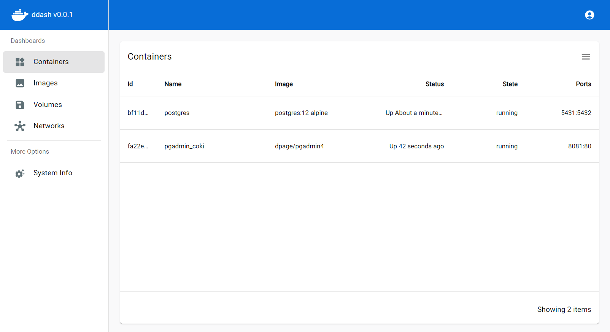
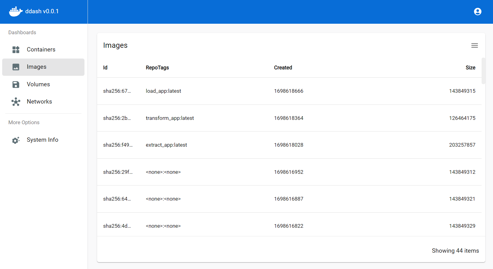
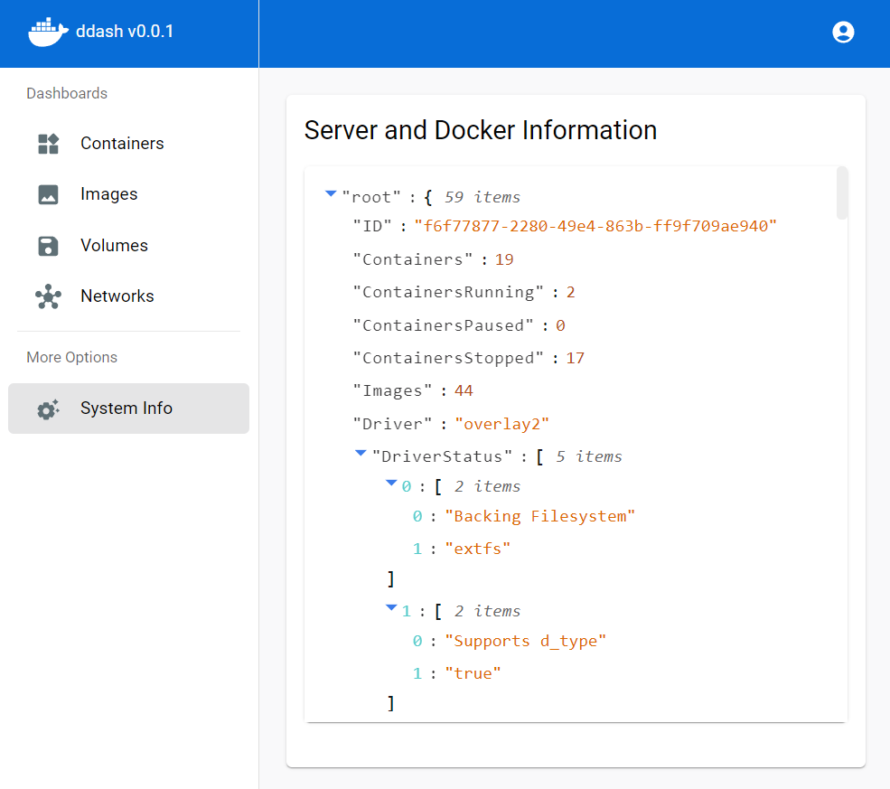
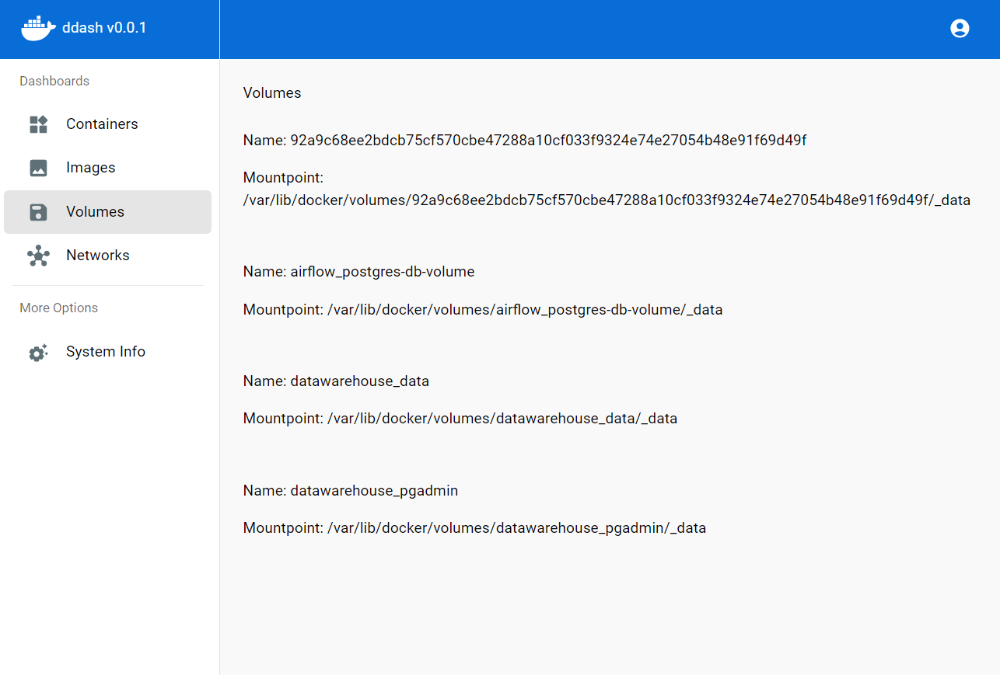
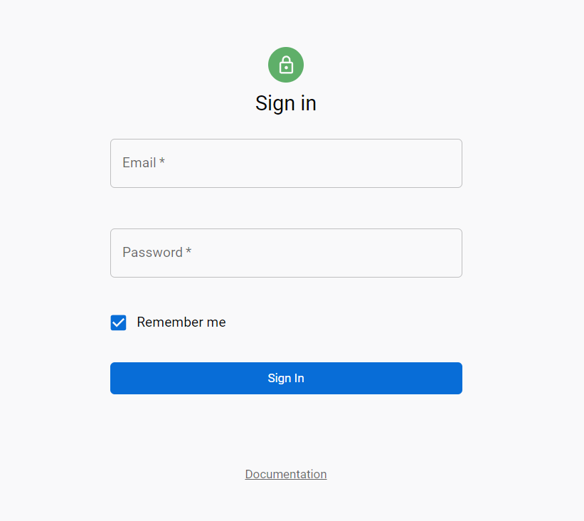

## WIP ⚠️

# ddash - Docker Web Dashboard 🐋🚢📈

ddash is a lightweight Docker Web Dashboard that provides a simple interface for managing Docker containers, images, volumes and networks.

## Features

- Resource Monitoring
- Container Management
- Image Management
- Volume Management
- Network Management
- Authentication

## Architecture

### Backend

Golang using Server-Sent Events (SSE).

### Frontend

React + Vite.

## Getting Started

1. **Prerequisites:** Ensure that Docker is installed on your local machine.

## Images 📷

